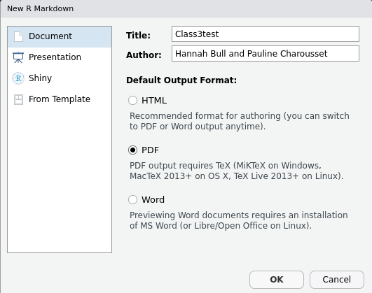
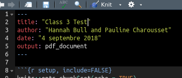

  
<style>
  body {background-color:lavender}
</style>
  
```{r setup, include=FALSE}
knitr::opts_chunk$set(echo = TRUE)
library("tidyverse")
library("knitr")
library("haven")
library("stargazer")

```

# Pre-class preparation

## Download MiKTeX or TexLive

You will need to download MiKTeX or TexLive for this class.

Windows: MiKTeX (Complete) - http://miktex.org/2.9/setup
(NOTE: Be sure to download the Complete rather than Basic installation)

Mac OS X: MacTeX 2013+ (Full) - http://tug.org/mactex/
(NOTE: Downloading with Safari rather than Chrome is strongly recommended)

Linux: TexLive 2013+ (Full) - `sudo apt-get install texlive-full`

## Test that you can create a pdf R Markdown file

1. Install package `knitr` (command `install.packages("knitr")`) 
2. Click File -> New File -> R Markdown 
3. Choose PDF output 

  

4. Save file (file extension is .rmd)
5. Click `Knit` (at the top of the window)  

  

6. You should then see a pdf file open. If not, read the error messages and try to resolve the problem. We are also here to help!  

## Supplementary instructions if the former does not work (Windows)

1. Install the package `devtools` 

2. Run: `devtools::install_github('yihui/tinytex')` 

3. Open the MikTeX Console (find it in the search bar), and in settings select 'always install packages on the fly'

# Today's exercise

We will learn how to create any type of document (homework, paper, slides, etc…) in any format (PDF, html, beamer) using Rmarkdown. The main advantage of Rmarkdown is that it allows you to create a single document that includes both your text and your code.

This document can then be **knitted** : you can tell R to convert your document to the format of your choice. When doing so, R reads the plain text of your document, but also evaluates the code chunks that you have included in your document. You have at your disposal a bunch of options that allow you to tell R whether the R output and code should be displayed in the final document or not.

To see an example of the homework exercise, which is the goal of today's lesson, [click here](https://introtor-pse.appspot.com/class3examplehomework.pdf).

# Set-up

Our aim for today is to learn how to write a document that contains tables and graphs that you create in R.

## Downloading the data

The data for today’s exercise can be downloaded from [here](https://drive.google.com/drive/u/1/folders/1jFcN7nzdc1J34_3koopHswNgSxXBTDU_).

## Opening an R markdown file 

In order to open an Rmarkdown file, you can click on the **+** sign below the **File** tab that you usually use to open an R script. This time, you can select R Markdown. A window appears, where you can write down the name of your document and choose its type (PDF, html…). If you did not manage to install LaTeX on your computer before the session, select the html option.

## Preambule

Your document starts with a preamble, declaring information on the type and structure of the document. 

```
---
title: "Title"
author: "First Name Last Name"
date: "September 11th, 2019"
output: pdf_document
---
```

The "output" line allows you to choose the document type. Here are the most commonly used document types:
* pdf_document produces a pdf file
* word_document produces a word file
* beamer_presentation produces a beamer document, i.e. slides compiled with LaTeX
* html_document produces an html file


# Plain text

You can structure your document with different sections and subsection using the # sign:

```
# Section
## Subsection
### Subsubsection
etc
```

You can then write your text as plain text. Here are a few useful commands that you can use to format your text.

Symbol      | Effect
------------- | -----------------------------------------------------------------------------------------------------------------
```*italics*```     | *italics* 
```**bold**```      | **bold** 
```exponent^2^```   | exponent^2^
```[link to Course website](https://introtor-pse.appspot.com/) ``` | [link to Course website](https://introtor-pse.appspot.com/)
```$y = \alpha + \beta x + \epsilon$``` | $y = \alpha + \beta x + \epsilon$


# Code chunks

The main advantage of using Rmarkdown is that you can include in your document pieces of code that might or might not be evaluated by R. These pieces of code are called Code chunks.

Here is how you can create a code chunk:

````r
`r ''````{r}
Write R your code here.
```
````

Within the {}, you can specify in which software's syntax you're writing your code (in your case, this is always going to be R) as well as a set of options for your Code chunk. The syntax is hence ```{r, options} ```.
 
The code options are:
 
Option | Effect 
----------| -------------------------------------------------------------------------------
eval = FALSE |  knitr will not run the code in the code chunk
include = FALSE |  knitr will run the chunk but not include the chunk in the final document
echo = FALSE |  knitr will not display the code in the code chunk above it’s results in the final document

The results options are:

Option | Effect 
----------| -------------------------------------------------------------------------------
results = 'hide' | knitr will not display the code’s results in the final document
results = 'hold' | knitr will delay displaying all output pieces until the end of the chunk 
warning = FALSE | knitr will not display any warning messages generated by the code
message = FALSE | knitr will not display any messages generated by the code

Let's install and load our packages, and load our data. Since we do not want this code chunk to appear in the final document, we are going to use the ```include = FALSE``` option. 

````r
`r ''````{r, include = FALSE, warning=FALSE, message=FALSE, error=FALSE}
list.of.packages <- c("tidyverse", "knitr", "haven", "stargazer")
new.packages <- list.of.packages[!(list.of.packages %in% installed.packages()[,"Package"])]
if(length(new.packages)) install.packages(new.packages, repos = "http://cran.us.r-project.org")

library("tidyverse")
library("knitr")
library("haven")
library("stargazer")

df <- read_dta("Data/Score_US.dta") # you might use a different function depending on your file format.
```
````

```{r, include = FALSE}
df <- read_dta("Data/Score_US.dta")
```

## Inline code

```{r, include = FALSE}
myvalue=42
```

Say we have predefined an object `myvalue=42`. In order to display this value in the text, use ` ` r myvalue ` ` to print `r myvalue`. 

# Tables

There are two ways to output tables in your final document:

- write down the table manually in the plain text of your Rmarkdown document 

- output a table that you have created in your R code 


## Make your table manually

Type this as plain text:

```
Row names | Values 
----------| ------
Row 1     | Value 1
Row 2     | Value 2
```

It should look like this: 

Row names | Values 
----------| ------
Row 1     | Value 1
Row 2     | Value 2

## Insert an R table


You can insert an R table to your document using the `kable` function. The syntax is as follows: `kable(table_name, options)`. Here are the most useful options of the `kable` function:

Option |	Effect
--------------------------------- | ------------------------------
align = c(“l”,“c”,“c”,“c”) |	First column will be aligned to the left, second to fourth columns will be centered
col.names = c(“Name 1”, “Name 2”, “Name 3”, “Name 4”) |	Defines the columns headers

Try to create a table containing some summary statistics for reading (`X4RSCALK1`) and maths (`X4MSCALK1`). The variables should be in rows and the different summary statistics (mean, sd, min, max) in columns. Remember that we want R to evaluate the code without displaying the code and its result in the document.

**Revision question 1**: The relevant variables have been selected for you, and the data has been converted from wide into long format for you. Group by the subject, then summarise the score, computing the mean, SD, min and max. Don't forget to ungroup at the end. 

```{r, include = FALSE}
table <- df %>%
  select(CHILDID, reading = X4RSCALK1, maths = X4MSCALK1) %>%
  gather(key = subject, value = score, reading:maths) %>%
  group_by(subject) %>%
  summarise(Mean = mean(score, na.rm = T), 
            SD = sd(score, na.rm = T), 
            Min = min(score, na.rm = T), 
            Max = max(score, na.rm = T)) %>%
  ungroup()
```

````r
`r ''````{r, include = FALSE}
table <- df %>%
  select(CHILDID, reading = X4RSCALK1, maths = X4MSCALK1) %>%
  gather(key = subject, value = score, reading:maths) %>%
  ### FILL HERE (group_by)
  ### FILL HERE (summarise, creating variables Mean, SD, Min, Max)
  ### FILL HERE (ungroup)
```
````

Let’s now output this table to our document. Since we do not want to output the code to our document, we are going to use the echo= FALSE option:

````r
`r ''````{r, echo = FALSE}
kable(table, caption = 'This is my caption')
```
````

```{r, echo = FALSE}
kable(table, caption = 'This is my caption')
```

## Make regression tables

You can use the R package `stargazer` to make nice tables, specifically regression tables. 

For example, you can use `stargazer(table)` to produce a latex table of the previous table we created, or you can easily create a table of a regression. See [the package documentation](https://cran.r-project.org/web/packages/stargazer/vignettes/stargazer.pdf) for more details. You will need to use `results='asis'` in the options for the code chuck in order for the table to appear. 

**Revision question 2**: Regress `X1RSCALK1` (reading score) on `X1MSCALK1` (maths score).

````r
`r ''````{r, echo = FALSE, results='asis', warning=FALSE, error=FALSE, message=FALSE }
fit <- ### FILL HERE
stargazer(fit,  header=FALSE, type='latex')
```
````

```{r, echo = FALSE, results='asis', warning=FALSE, error=FALSE, message=FALSE }
fit <- lm(X1RSCALK1 ~ X1MSCALK1, data=df)
stargazer(fit,  header=FALSE, type='html')
```


# Insert Figures

## Insert figures from a folder

```

```

## Insert R figures

Try to insert the distribution of the variable of your choice to the document. Make sure no unintended message will be output to the document, and center the figure using the `fig.align='center'`option.

**Revision question 3**: Create a univariate ggplot using the variable `X4RSCALK1` (reading score). The geometry is a histogram plot. Add the classic theme and label the x-axis with "Reading score".

````r
`r ''````{r , fig.width = 5, fig.height = 4, warning = FALSE, echo = FALSE, error = FALSE, message = FALSE, fig.align='center'}
### FILL HERE
```
````

```{r, fig.width = 5, fig.height = 4, warning = FALSE, echo = FALSE, error = FALSE, message = FALSE, fig.align='center'} 
ggplot(data = df, aes(x = X4RSCALK1)) + 
      geom_histogram() + 
      theme_classic() + 
      labs(x = "Reading score") 
```


# Add a bibliography to the document

In order to add a bibliography to the end of your document, you first need to create a .bib file in LaTeX that contains the list of references that you want to cite in BibTeX format.

In order to obtain the BibTeX references of the paper, you can search for the paper in Google Scholar and select the “” sign. Then, click on BibTeX and copy and paste the reference to your .bib file.

Then, add a line specifying the .bib file name to the Preamble:

`bibliography: biblio.bib`

You should insert the reference as follows, in you text:

Blablabla, as was shown by @reference_name.

This will result in:

- a sentence that looks like this: Blablabla, as was shown by Author name (review year)
- the full reference at the end of your document


# Exercise

Using the dataset of your choice, create an article template including: 

- Headings and subheadings

- Some text (lorem ipsum)

- A summary statistics table

- A ggplot

- A regression table with one simple regression 

- An inline value incorporated in the text

- A mathematical formula in the text

- A bibliography with at least 2 references

**The article does not need to make sense!**

You can find many free data sets online, for example: 

[UCI Machine Learning Repository](https://archive.ics.uci.edu/ml/datasets.php) 

[World Bank](https://datacatalog.worldbank.org/) 

[OECD](https://data.oecd.org/home/) 


Upload your PDF file at the link on the homepage.
