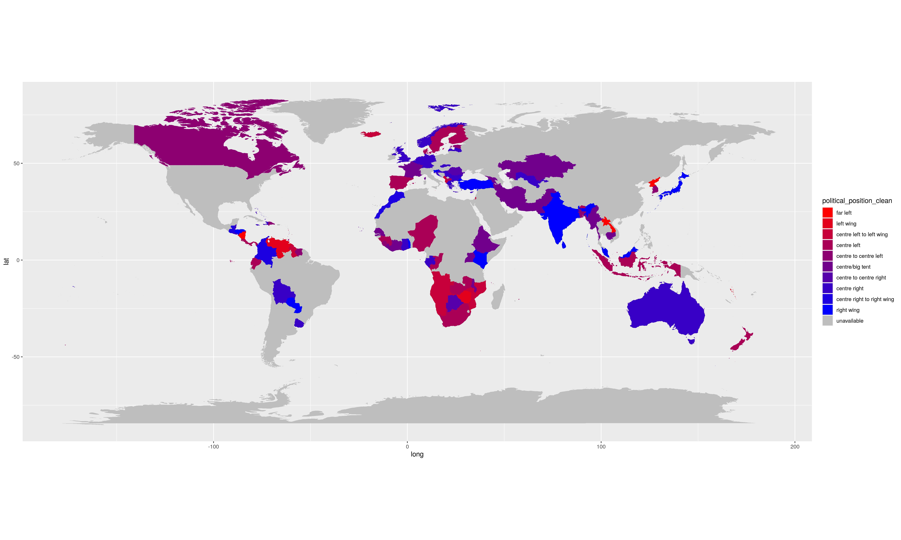

<style>
  body {background-color:lavender}
</style>

```{r setup, include=FALSE}
knitr::opts_chunk$set(echo = TRUE)
# knitr::opts_knit$set(root.dir = "/home/hannah/repos/introtor")
require("tidyverse")
require("sf")
require("countrycode")
require("maps")
require("DT")
```

# Today's exercise

We will scrape data off Wikipedia on the leaders of all of the countries in the world, their political parties and the political orientation of their parties. This will allow us to plot a map of the world coloured by political orientation of the leader of many countries. 



We will be using the page [List of current heads of state and government](https://en.wikipedia.org/wiki/List_of_current_heads_of_state_and_government) in order to obtain a list of names of current heads of government in each country. We wil then be searching the Wikipedia links to each of these current heads, in order to scrape their political party off Wikipedia. Then, we will be searching the Wikipedia links to each of these parties in order to identify their political position. 

# Set-up

You will need a browser such as Chrome or Firefox and an internet connection. You will also need the packages `tidyverse` and `rvest` for the web scraping part, and the packages `countrycode` and `maps` for the to produce the map later on. 

```{r installifnotinstalled, warning=FALSE,message=FALSE,error=FALSE}
### installs if necessary and loads tidyverse and sf, another package which we will be using today
list.of.packages <- c("tidyverse", "rvest", "countrycode", "maps")
new.packages <- list.of.packages[!(list.of.packages %in% installed.packages()[,"Package"])]
if(length(new.packages)) install.packages(new.packages, repos = "http://cran.us.r-project.org")

invisible(lapply(list.of.packages, library, character.only = TRUE))
```

# Theory

To begin, we will briefly cover four aspects of essential theory: functions, loops, regular expressions and XPaths. 

## Functions

A function is an operation to be evaluated on arguments. For example, we can define a function called `square_root` which computes the square root of an argument `x`. 

```{r fn, results = "hide", warning=FALSE,message=FALSE,error=FALSE}
square_root <- function(x) {
  sqrt(x)
}
```

To evaluate this function at the value `x=9`, we can type `square_root(9)`, which will output the value 3. Functions can have multiple arguments, or even no arguements. 

```{r fn2,results = "hide", warning=FALSE,message=FALSE,error=FALSE}
sum_square_root_x_y <- function(x,y) {
  sqrt(x)+sqrt(y)
}

print_hello <- function() {
  print("Hello world!")
}
```

## Loops

A loop evaluates an operation on each value of a given vector. For example: 

```{r loop, results = "hide", warning=FALSE,message=FALSE,error=FALSE}
for (x in c(1,4,9,16,25)) {
  print(square_root(x))
}

for (word in c("Welcome", "to", "PSE")) {
  print(word)
}
```

### tryCatch

Often, we do not want our R script to stop due to one error, especially when we are running a loop over many elements. For example, if we are trying to scrape information off hundreds of websites, we do not want our script to stop every time one of the websites is down, or doesn't have the structure we expect. 

To deal with errors, we can use the function `tryCatch`. The syntax of this function is: `tryCatch({do something}, error = function(e) {do somethingelse})`. 

```{r trycatch, results = "hide", warning=FALSE,message=FALSE,error=FALSE}
for (x in c("a", "b")) {
  tryCatch({
    print(square_root(x))
  }, error = function(e) {
    print(paste("Error for", x))
  })
}
```

## Regular expressions

Regular expressions are used to identify strings following a specified pattern. 

Regex      | Description
------------- | -------------
^             | Start of string OR not
$         | End of string
. | Wildcard (type `\\.` to mean full-stop)
[A-Z] | Any capital letter from A to Z
[a-z] | Any lowercase letter from a to z
[0-9] | Any digit from 0 to 9
[:alnum:] | Any alpha-numeric character
[:punct:]| Any punctuation character
[:alpha:] | Any alphabetical character
[:upper:] | Any uppercase character
[:lower:] | Any lowercase character
[:digit:] | Any digit
[^abc] | Not a, b or c
* | 0 or more occurences
+ | 1 or more occurences
{n} | n occurences
{n,} | n or more occurences
{n,m} | between n and m occurences

Some examples: 

Regex      | Meaning   | Some examples
------------- | -------------------------------- | --------------------------
`".*\\.jpg$"`             | Ending in .jpg | `"image1.jpg"`, `"Output/map.jpg"`
`"^[A-B][:lower:]+.*"`       | Starting with A or B, followed by at least 1 lower case letter | `"Adam Smith"`
`".*@gmail\\.com$"`       | Anything ending in @gmail.com | `"john.smith@gmail.com"`
`"^[0-9]{5}$"`       | A string with 5 digits between 0 and 9 | `"01234"`


## XPaths

If you access the page [List of current heads of state and government](https://en.wikipedia.org/wiki/List_of_current_heads_of_state_and_government) and right-click to view the source code, then you can see the html code behind the website. 

Html code is structured by 'tags'. For example, the document starts with the tag `<html>` and ends with the tag `</html>`. For example, a html table is contained between the tags `<table>` and the tag `</table>`, and a link to another website is contained within the tags `<a>` and the tag `</a>`. 

XPaths are paths to html tags. For example, the XPath `/html/body/div[3]/div/table[2]` is the path to the second table tag in the div tag in the third div tag in the body tag in the html tag. 

If we are interested in scraping a certain object, such as a table or a link from a html page, then we can use the XPath of that object to access it. 

In order to access the XPath of an object, we can right click somewhere on the object, click 'Examine element', then find the html tag of the object we would like to access. We can then right click on the html tag and copy the XPath to paste into our R code. . 

We can also use the text contents of an object to specify the XPath. For example, the XPath `"//a[text()='Alain Berset']"` gives us all `<a>` tags with the text 'Alain Berset'. This is useful for finding links behind the text 'Alain Berset' on the Wikipedia page. 

We can use the argument 'contains' in order to partially specify attributes of a html tag. For example, `//table[contains(@class, "infobox")]` selects all tables where the table class contains the word 'infobox'. 

Two dots in an XPath returns to the parent tag. For example, the XPath `//th[text()="Political party"]/..` returns us to the parent tag of the 'th' tag with the text 'Political party'. 

# Scraping government leaders and their Wikipedia pages

In a first step, we aim to scrape the table of government leaders on the page [List of current heads of state and government](https://en.wikipedia.org/wiki/List_of_current_heads_of_state_and_government), as well as the links to the Wikipedia pages of each of the leaders. 

## Reading html data and extracting tables

We use the function `read_html` in the `rvest` package to read html data from a website. We use the function `html_nodes` to select the portion of the html document under a particular XPath. We then use `html_table` to extract the table under the XPath.

```{r readhtml, warning=FALSE,message=FALSE,error=FALSE}
# get webpage
html_heads <- read_html("https://en.wikipedia.org/wiki/List_of_current_heads_of_state_and_government")

# extract table
df <- html_heads %>%
  html_nodes(xpath = '/html/body/div[3]/div[3]/div[5]/div[1]/table[2]') %>%
  html_table(fill=TRUE) %>%
  .[[1]]
```

```{r datatable, warning=FALSE,message=FALSE,error=FALSE, echo=FALSE}
datatable(df)
```

## The function `gsub`

The function `gsub` takes 3 main arguments. The first argument is a regular expression to replace, the second argument is a string to replace it with, and the final argument is the object in which to make this replacement. For example, we can remove all letters preceding `- `, or we can remove the string "Prince" at the start of a string. We use this to clean up the names of the world leaders, such that the text of the name is the text in the link to their Wikipedia page. 

```{r fungsub, warning=FALSE,message=FALSE,error=FALSE}
df <- html_heads %>%
  html_nodes(xpath = '/html/body/div[3]/div[3]/div[5]/div[1]/table[2]') %>%
  html_table(fill=TRUE) %>%
  .[[1]] %>%
  mutate(leader = gsub(".*– ", "", `Head of government`)) %>%
  mutate(leader = gsub(".*\u2013 ", "", leader)) %>% # this line is for the windows computers where the previous line does not work
  mutate(leader = gsub("^Sheikh |^Cardinal |^Prince ", "", leader)) %>%
  mutate(leader = gsub(" \\(.*$|\\[.*$", "", leader)) %>%
  mutate(leader = ifelse(leader=="Hasina", "Sheikh Hasina", leader)) %>%
  select(State, leader) %>%
  filter(!duplicated(State))
```

## Extracting links

Links to other pages are contained within `<a>` tags. If we wish to extract the link behind the name "Alain Berset", for example, we can search for the `<a>` tag with the text "Alain Berset", then use the function `html_attr` to extract the link from the `<a>` tag. 

```{r getlinkleaderex, warning=FALSE,message=FALSE,error=FALSE}
### useful function to get link behind text on webpage
get_link_text <- function(text, html_page){
  tryCatch({
    html_page %>%
      html_nodes(xpath=paste0("//a[text()='", text, "']")) %>% 
      .[[1]] %>% 
      html_attr("href")
  }, error = function(e) {
    print(paste("Error for", text))
  })
}
```

We can now integrate this function into a `lapply` in order to extract the links for all the heads of government in a vector. 

```{r getlinkleaderloop, results="hide", warning=FALSE,message=FALSE,error=FALSE}
df <- html_heads %>%
  html_nodes(xpath = '/html/body/div[3]/div[3]/div[5]/div[1]/table[2]') %>%
  html_table(fill=TRUE) %>%
  .[[1]] %>%
  mutate(leader = gsub(".*– ", "", `Head of government`)) %>%
  mutate(leader = gsub(".*\u2013 ", "", leader)) %>% # this line is for the windows computers where the previous line does not work
  mutate(leader = gsub("^Sheikh |^Cardinal |^Prince ", "", leader)) %>%
  mutate(leader = gsub(" \\(.*$|\\[.*$", "", leader)) %>%
  mutate(leader = ifelse(leader=="Hasina", "Sheikh Hasina", leader)) %>%
  select(State, leader) %>%
  filter(!duplicated(State)) %>%
  mutate(link_leader = lapply(leader, get_link_text, html_page=html_heads)) 
  # lapply(LIST, FUNCTION, FIXED ARGUMENTS OF FUNCTION)
```

# Extracting parties 

In this step, we extract the political party and the Wikipedia link to the party from each of the pages of the world leaders from their respective Wikipedia pages. 

```{r getpartyex, warning=FALSE,message=FALSE,error=FALSE}
## first do example
get_link_party_example <- "https://en.wikipedia.org/wiki/Jean_Castex" %>%
  read_html() %>%
  html_nodes(xpath='//table[contains(@class, "infobox")]/tbody/tr/th[text()="Political party"]/../td/a') %>%
  html_attr("href") %>%
  tail(., n=1)
```

## Converting this example into a function

We convert this example into a function of the political leader's Wikipedia page. 

```{r getpartyfn, warning=FALSE,message=FALSE,error=FALSE}
## then write function 
get_link_party <- function(leader_link){
  paste0("https://en.wikipedia.org", leader_link) %>%
    read_html() %>%
    html_nodes(xpath='//table[contains(@class, "infobox")]/tbody/tr/th[text()="Political party"]/../td/a') %>%
    html_attr("href") %>%
    tail(., n=1)
}
```

## Integrating the function into a loop

We incorporate this function into a loop with a tryCatch.

```{r getpartyloop, results="hide", warning=FALSE,message=FALSE,error=FALSE}
## then write loop
df$link_party <- ""
for (i in 1:nrow(df)) {
  tryCatch({
    df$link_party[i] <- get_link_party(df$link_leader[i])
    print(paste("Got link for party of", df$leader[i]))
  }, error = function(e) {
    print(paste("Error for", df$leader[i]))
  })
}
```


### Correcting by hand

We can correct any errors in the loop by hand. 

```{r correct, warning=FALSE,message=FALSE,error=FALSE}
df <- df %>%
  mutate(link_party=ifelse(leader=="Angela Merkel", "/wiki/Christian_Democratic_Union_of_Germany", link_party))
```

# Extracting political positions

Now we wish to extract the political positions from the political party Wikipedia pages.

## The function `grepl`

The function `grepl` has two main arguments, the first is a regular expression and the second is the string that we wish to search. The output is TRUE or FALSE depending on whether or not the regular expression matches the string. Here we use a regular expression to overcome various spellings and cases of "Political position".

```{r getlinkpartyquiz, eval=FALSE, warning=FALSE,message=FALSE,error=FALSE}
## first write example
get_political_position_example <- "https://en.wikipedia.org/wiki/La_R%C3%A9publique_En_Marche!" %>%
  read_html() %>%
  html_nodes(xpath='//table[contains(@class, "infobox")]') %>%
  html_table(fill=TRUE) %>%
  .[[1]] %>%
  set_tidy_names() %>%
  filter(grepl('*olitical.*osition', .[,1])) %>%
  .[1,2]

## then write function 
get_political_position <- function(party_link){
  ### FILL HERE
}

## then write loop 
df$political_position <- ""
for (i in 1:nrow(df)) {
  ### FILL HERE
}
```

```{r getlinkparty, include=FALSE, echo=FALSE,message=FALSE,error=FALSE}
## first write example
get_political_position_example <- "https://en.wikipedia.org/wiki/La_R%C3%A9publique_En_Marche!" %>%
  read_html() %>%
  html_nodes(xpath='//table[contains(@class, "infobox")]') %>%
  html_table(fill=TRUE) %>%
  .[[1]] %>%
  set_tidy_names() %>%
  filter(grepl('*olitical.*osition', .[,1])) %>%
  .[1,2]

## then write function 
get_political_position <- function(party_link){
  paste0("https://en.wikipedia.org", party_link) %>%
    read_html() %>%
    html_nodes(xpath='//table[contains(@class, "infobox")]') %>%
    html_table(fill=TRUE) %>%
    .[[1]] %>%
    set_tidy_names() %>%
    filter(grepl('*olitical.*osition', .[,1])) %>%
    .[1,2]
}

## then write loop 
df$political_position <- ""
for (i in 1:nrow(df)) {
  tryCatch({
    df$political_position[i] <- get_political_position(df$link_party[i])
    print(paste("Got political position of", df$leader[i]))
  }, error = function(e) {
    print(paste("Error for", df$leader[i]))
  })
}
```

```{r printtable, echo=FALSE,message=FALSE,error=FALSE}
datatable(df)
```

# Creating a map 

Here we use regular expressions and functions that you know already in order to plot the political orientation of leaders on a world map. 

```{r cleaningmap, message=FALSE,error=FALSE, warning=FALSE}
## Cleaning
political_classification = c("far left","left wing","centre left to left wing", "centre left", 
                             "centre to centre left", "centre/big tent", "centre to centre right", "centre right",
                             "centre right to right wing", "right wing", "unavailable")

df_clean <- df %>%
  select(State, political_position) %>%
  mutate(political_position_clean = political_position) %>%
  mutate(political_position_clean=gsub("^[^:]+:", " ", political_position_clean)) %>%
  mutate(political_position_clean=gsub(":.*$", " ", political_position_clean)) %>%
  mutate(political_position_clean=gsub("[0-9]{4}.*$", " ", political_position_clean)) %>%
  mutate(political_position_clean=gsub("\\([^()]*\\)", "", political_position_clean)) %>%
  mutate(political_position_clean=gsub("\\[[^[]]*\\]", "", political_position_clean)) %>%
  mutate(political_position_clean=tolower(political_position_clean)) %>%
  mutate(political_position_clean=gsub("[^a-z ]", " ", political_position_clean)) %>%
  mutate(political_position_clean=str_trim(political_position_clean)) %>%
  mutate(political_position_clean=ifelse(political_position_clean=="", NA, political_position_clean)) %>%
  mutate(political_position_clean=gsub("center", "centre", political_position_clean)) %>%
  mutate(political_position_clean=gsub("tocentre", "to centre", political_position_clean)) %>%
  mutate(political_position_clean=gsub("toright", "to right", political_position_clean)) %>%
  mutate(political_position_clean=gsub(" formerly", "", political_position_clean)) %>%
  mutate(political_position_clean=gsub("historical", "", political_position_clean)) %>%
  mutate(political_position_clean=gsub(" correa era", "", political_position_clean)) %>%
  mutate(political_position_clean=gsub(" citation needed", "", political_position_clean)) %>%
  mutate(political_position_clean=gsub("economic", "", political_position_clean)) %>%
  mutate(political_position_clean=gsub("after", "", political_position_clean)) %>%
  mutate(political_position_clean=str_trim(political_position_clean)) %>%
  mutate(political_position_clean=gsub("centre left to centre right", "centre", political_position_clean)) %>%
  mutate(political_position_clean=gsub("big tent of the left", "big tent", political_position_clean)) %>%
  mutate(political_position_clean=gsub("big tent", "centre/big tent", political_position_clean)) %>%
  mutate(political_position_clean=gsub("^centre$", "centre/big tent", political_position_clean)) %>%
  mutate(political_position_clean = ifelse(political_position_clean %in% political_classification, political_position_clean, NA)) %>%
  mutate(iso3 = countrycode(State, "country.name", "iso3c")) %>%
  mutate(iso3 = ifelse(State=="Micronesia", "FSM", iso3))

map_world <- map_data("world") %>%
  mutate(iso3 = countrycode(region, "country.name", "iso3c")) %>%
  mutate(iso3 = ifelse(region=="Micronesia", "FSM", iso3)) %>%
  left_join(df_clean, by="iso3") %>%
  mutate(political_position_clean=ifelse(is.na(political_position_clean), "unavailable", political_position_clean)) %>%
  mutate(political_position_clean=factor(political_position_clean,
                                         levels = political_classification,
                                         labels = political_classification))

plot <- ggplot() +
  geom_polygon(data = map_world, aes(x = long, y = lat, group = group, fill = political_position_clean)) +
  scale_fill_manual(values = c("#FF0000","#E2001C","#C60038", "#AA0055", "#8D0071", 
                               "#71008D", "#5500AA", "#3800C6","#1C00E2", "#0000FF", "#bebebe")) + coord_fixed()

ggsave("Output/worldmappolitics.jpg", width = 20, height=12, device = "jpg")
```

# Exercises

1. Fill in the code blanks
2. Comment the lines of the code that are unclear to you
3. Correct a few errors for countries that were not scrapped correctly

Upload your script and .jpg map at the link provided on the homepage.